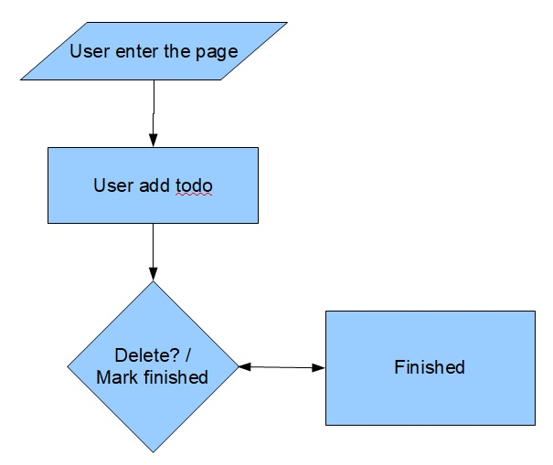
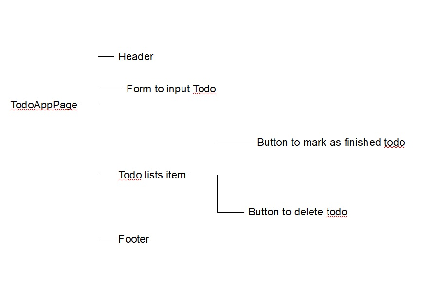
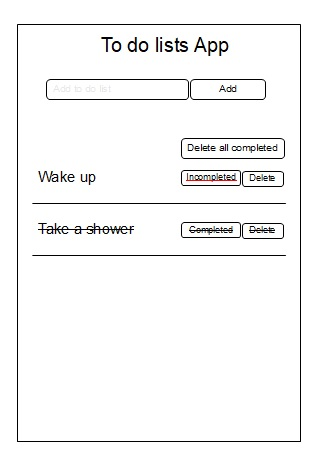

Everyone has their own way when building an application from scratch, and sometimes we're not convenient with their way because each person has their own cozy method.
So do I, this is what I did to get started building an application from scratch.

## Defining what application that we build
For now example we would build Todolist application, whose the purpose is follows :
- Users create todo records.
- Users can mark the todo as finished or undo it as unfinished.
- Users can delete todo records.
  
We got the definition of application above because it is very simple, the more complicated the application the more points we have to define.

## Create flow application
Flow application describing how the application interaction with user from start to the end, you can create flow application just using notes, or using diagram, I prefer to create flow application using diagram like this :



1. User enter the page
2. User create new todo
3. User mark as finished todo
4. User delete todo

## Create the mindmap
Mind map explaining what information that we’re gonna show to users when he enter the page, just because our app has one page, the mind map just contain only :



The mind map above also makes it easier for us when we’re making the sketch view.

## Create the sketch view
The sketch view just a simple display for our website, without coloring, without typography, only a sketch like so :



## Designing front end application
Before we build a front end application, we have to define the sketch into a completed design. You can use one of many tools like figma, adobe xd, InVison, and so on.
We did a design using figma, and here are the end results :

.png)

## Coding for front end application
Now the time has come, we’re gonna coding for front end application, but before we doing that process, it would be better if we’re analyze the design and got the conclusion what elements will we create, this is how I analyze the design and got conclusion what element I would create :

.png)

As seen above, we will create as many as 5 components namely :
1. Header.
2. Button.
3. Form to enter new todo.
4. Todo.
5. Todolists.
   
There are many types of framework and programming language to create a front end application, I considered choosing the hype framework called React that uses javascript language for building this app.

### Let's start by creating the header component
Create *Header.jsx* file with following content :

```jsx
import React from 'react'

const Header = () => {
    return (
        <header>
            <h1>React todolist</h1>
        </header>
    )
}

export default Header;
```

### Create the button component
Create a Folder name Button, and create *index.css* file, the style for *Button component*, this is the content of the file.

```css
/* CSS */
.button-18 {
  align-items: center;
  border: 0;
  border-radius: 100px;
  box-sizing: border-box;
  color: #ffffff;
  cursor: pointer;
  display: inline-flex;
  font-family: -apple-system, system-ui, system-ui, "Segoe UI", Roboto, "Helvetica Neue", "Fira Sans", Ubuntu, Oxygen, "Oxygen Sans", Cantarell, "Droid Sans", "Apple Color Emoji", "Segoe UI Emoji", "Segoe UI Symbol", "Lucida Grande", Helvetica, Arial, sans-serif;
  font-size: 16px;
  font-weight: 600;
  justify-content: center;
  line-height: 20px;
  max-width: 480px;
  min-height: 40px;
  min-width: 0px;
  overflow: hidden;
  padding: 0px;
  padding-left: 20px;
  padding-right: 20px;
  text-align: center;
  touch-action: manipulation;
  transition: background-color 0.167s cubic-bezier(0.4, 0, 0.2, 1) 0s, box-shadow 0.167s cubic-bezier(0.4, 0, 0.2, 1) 0s, color 0.167s cubic-bezier(0.4, 0, 0.2, 1) 0s;
  user-select: none;
  -webkit-user-select: none;
  vertical-align: middle;
  color: #ffffff;
  margin-right: 3px;
}

.button-18:disabled { 
  cursor: not-allowed;
  background: rgba(0, 0, 0, .08);
  color: rgba(0, 0, 0, .3);
}

.primary {
  background-color: #66ccff;
}

.primary:hover,
.primary:focus,
.primary:active { 
  background-color: #3399ff;
}


.danger {
    background-color: #ff6666;
}
  
.danger:hover,
.danger:active,
.danger:focus { 
background-color: red;
}


.warning {
    background-color: #ffff66e5;
    color: black;
}
  
.warning:hover,
.warning:active,
.warning:focus { 
background-color: yellow;
}

```


Create *index.jsx* file with following content :

```jsx
// import react
import React from 'react';
// import prop types
import propTypes from "prop-types";
// import style
import "./index.css"

// export button components
export default function Button(props) {
    // button text value
    const { value } = props
    // array of class name
    let className = []
    // if the props button is primary
    if (props.isPrimary) className.push("primary")
    // if the props button is danger
    if (props.isDanger) className.push("danger")
    // if the props button is warning
    if (props.isWarning) className.push("warning")

    return (
        <button 
        //   id of button
          id={props.id} 
        // style of button
          style={props.style} 
        // when button clicked
          onClick={props.onClick} 
        // class of button
          className={["button-18", className].join(" ")} 
        // role of element
          role="button"
        >
          {value}
        </button>
    )

}

Button.prototype = {
    // is primary props type
    isPrimary: propTypes.bool,
    // is danger props type
    isDanger: propTypes.bool,
    // is warning props type
    isWarning: propTypes.bool,
    // value props type
    value: propTypes.string,
    // id props
    id: propTypes.string,
    // style props
    style: propTypes.string,
    // onclick prop types
    onClick: propTypes.func,
}
```

### Create component form to enter new todo
Create folder name *Form*, then create *index.css* file, with the following content
```css
.todo-form {
  border: 1px solid#3399ff;
  border-radius: 100px;
  box-sizing: border-box;
  color: #000000;
  display: inline-flex;
  font-family: -apple-system, system-ui, system-ui, "Segoe UI", Roboto, "Helvetica Neue", "Fira Sans", Ubuntu, Oxygen, "Oxygen Sans", Cantarell, "Droid Sans", "Apple Color Emoji", "Segoe UI Emoji", "Segoe UI Symbol", "Lucida Grande", Helvetica, Arial, sans-serif;
  font-size: 16px;
  line-height: 20px;
  max-width: 480px;
  min-height: 40px;
  min-width: 0px;
  overflow: hidden;
  padding: 0px;
  padding-left: 20px;
  padding-right: 20px;
  touch-action: manipulation;
  transition: background-color 0.167s cubic-bezier(0.4, 0, 0.2, 1) 0s, box-shadow 0.167s cubic-bezier(0.4, 0, 0.2, 1) 0s, color 0.167s cubic-bezier(0.4, 0, 0.2, 1) 0s;
  user-select: none;
  -webkit-user-select: none;
  vertical-align: middle;
  margin-right: 3px;
}
```

Create a file *index.jsx*, the form component with the following content
```jsx
import React, { useState } from 'react'
import Button from "../Button"
import "./index.css"

export default function TodoForm(props) {
    const [userInput, setUserInput] = useState('')

    const handleChange = (e) => {
        setUserInput(e.currentTarget.value)
    }

    const handleSubmit = (e) => {
        e.preventDefault()
        props.addTask(userInput)
        setUserInput('')
    }
    return (
        <div>
            <form style={{ marginBottom: 10 }} onSubmit={handleSubmit}>
                <input class="todo-form" type="text" value={userInput} onChange={handleChange} placeholder="Enter task" />
                <Button isPrimary value="Add" />
            </form>
        </div>
    )
}

```
### Create todo component
Create *Todo.jsx* file with the following content
```jsx
import React from 'react'
import Button from "../elements/Button"

export default function Todo(props) {
    const { todo } = props;

    // function to handle button on todo when it clicked
    const handleClick = (e) => {
        // prevent all deafult function
        e.preventDefault()
        // function to toggle complete or incomplete
        if (e.currentTarget.className.includes("warning")) {
            props.toggle(e.currentTarget.id)
        }
        // delete todo
        else if (e.currentTarget.className.includes("danger")) {
            props.delete(e.currentTarget.id)
        }
    }

    // return component
    return (
        <div
            className={todo.complete ? "todo complete" : "todo"}
        >
            {todo.task}
            {todo.id && <span style={{ marginLeft: "auto" }}>

                <Button
                    isWarning
                    value={todo.complete ? "Completed" : "Incompleted"}
                    onClick={handleClick}
                    id={todo.id}
                />

                <Button
                    isDanger
                    value="Delete"
                    onClick={handleClick}
                    id={todo.id}
                />
            </span>}
        </div>
    )
}

```

### Create lists of todo component
```jsx
import React from 'react'
import Todo from "./Todo"
import propTypes from "prop-types";

export default function TodoList(props) {
    const { list } = props;
    return (
        <div className="todo-list-board">
            {list.length > 0 && list.map((todo) => {
                return (
                    <div key={todo.id}>
                        <Todo todo={todo} delete={props.deleteTodo} toggle={props.handleToggle} />
                    </div>
                )
            })
            }
            {list.length < 1 && <div>
                <Todo todo={{
                    id: false,
                    task: "Nothing todo",
                    complete: false
                }} />
            </div>}
        </div>
    )
}

// default props when parent passing no props
TodoList.defaultProps = [{
    id: "kosong",
    task: "nothing todo",
    complete: false
}]

// Todo proptypes
Todo.propTypes = {
    list: propTypes.object,
    handleToggle: propTypes.func,
    deleteAllTodo: propTypes.func,
    deleteTodo: propTypes.func
}
```

### Combining all component
Create a file *App.css* style for default web with the following content
```jsx
.App {
  text-align: center;
}

button {
  font-size: calc(10px + 2vmin);
}

.container {
  border: 5px solid black;
  border-radius: 10px;
  margin: 10px auto 0 auto;
  max-width: 600px;
  min-height: 95vh;
  word-wrap: break-word;
}

.todo {
  border-bottom: 1px solid rgba(34, 33, 33, 0.418);
  padding: 10px;
  display: flex;
  align-items: center;
}

.todo:hover {
  background-color: lightgray;
}

.complete {
  background-color: cadetblue;
  text-decoration: line-through;
}

.todo-list-board {
  text-align: left;
}
```

Create *App.jsx* file, that will combine all component 
```jsx
import './App.css'
import { useState } from 'react'
import Button from "./components/elements/Button";
import Header from "./components/elements/Header";
import TodoList from "./components/parts/TodoList";
import TodoForm from "./components/elements/Form";

function App() {
  const [todo, setTodo] = useState('');

  // Toggle comoplete todo
  const handleToggle = (id) => {
    // console.log(id)
    let mapped = todo.map((task) => {
      return task.id === + id ? { ...task, complete: !task.complete } : { ...task }
    })
    setTodo(mapped)
  }

  // Delete all todo that completed
  function deleteAllTodo() {
    let filtered = todo.filter((task) => {
      return !task.complete
    })
    setTodo(filtered);
  }

  // delete particular todo
  function deleteTodo(id) {
    let filter = todo.filter((task) => {
      return task.id !== +id
    })
    setTodo(filter)
  }

  const addTask = (userInput) => {
    let copy = [...todo];
    copy = [...copy, { id: todo.length + 1, task: userInput, complete: false }]
    setTodo(copy)
  }

  return (
    <div className="App">
      <div className="container">
        <Header />
        <TodoForm addTask={addTask} />
        <span style={{ display: 'flex', marginBottom: 15 }}>
          {
            todo.length > 1 && <Button onClick={deleteAllTodo} isDanger style={{ marginLeft: 'auto' }} value="Delete all completed" />
          }
        </span>
        <TodoList list={todo} handleToggle={handleToggle} deleteAllTodo={deleteAllTodo} deleteTodo={deleteTodo} />
      </div>
    </div>
  )
}
export default App

```

The front end application is completed, we can do manipulation data for now, but the data is temprorary because we don't store it to any database.

We need to build backend application to store all data that we're going to do in the next step.

## Designing backend application
As previously, before we do coding for backend applications, it would be better to analyze what data to store and what service that front end application needed.
Based on design application, we’re just need data structure to store like below 
Id = unique identity of record
Todo = value of todo
isCompleted = the mark of todo is that completed or no
Whereas the service of backend we’re just need :
Service to create new todo
Service to mark todo as complete or incomplete
Service to delete todo

## Creating database based on data structure
I decided to use mysql for this application among many choices database management system, this is the database view that I setup :

```sql
+-------------+------------+------+-----+---------+----------------+
| Field       | Type       | Null | Key | Default | Extra          |
+-------------+------------+------+-----+---------+----------------+
| id          | bigint(20) | NO   | PRI | NULL    | auto_increment |
| todo        | text       | NO   |     | NULL    |                |
| isCompleted | tinyint(1) | NO   |     | 0       |                |
+-------------+------------+------+-----+---------+----------------+
```

## Coding for backend application
There are many programming languages for creating backend applications. I considered using PHP, a popular language since 1995, let’s get started.
### Create a file connection from app to database
### Create a .htaccess file to make beautiful URL
### Create a file that contain our model
### Create a file that receive request from front application
## Integration between backend application vs front end application
We are almost done, we will add some function every application doing manipulation data like add todo, mark todo as completed or uncompleted, and delete todo, let's get in to it
### Add function to save new todo to backend application
### Add function to save
## Conclusion
Building an application sometimes it’s fun, but when the application gets more complex you may need to prepare a lot of patience, because your intelligence, your skill, your IQ is not enough to finish the whole application alone.
This Post become simple because I didn't tell you another process that very important likes :
How to do unit testing for each file (Programmer Job).
How to do integration testing of the whole application (Programmer Job).
How to do End To End testing the whole application (QA Job).
How to test security of the application (QA Job)
How to create Continuous integration / Continuous deployment (Devops Job).
How to deploy applications to the cloud or server  (Devops Job).
And many more that I don't know yet 😀
Impossible for somebody to build complex applications alone, this meme may can relate ✌️.


